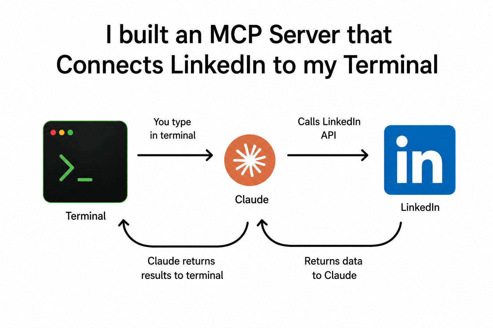

# linkedin-mcp

I'm a mechanical engineering student. I wanted to search LinkedIn from my terminal using AI — no browser, no clicking, just ask Claude a question and get real LinkedIn data back.

It took three attempts. Two failed. One works. Here's the honest story and how to run it.




## What this does

You type something like:

> "search linkedin for mechanical engineers in Philadelphia"

Claude calls LinkedIn directly and returns real results — names, job titles, companies, locations — all in your terminal. No browser opened.

## What you need

- A LinkedIn account
- Python 3.11+ and `uv`
- Node.js 18+ and `npm`
- Claude Code, Cursor, or Windsurf (or none — the scripts run standalone too)

## Attempt 1 — Python library (failed)

Started with [`linkedin-api`](https://github.com/tomquirk/linkedin-api). Built a FastMCP server on top of it, registered it with Claude Code. It worked briefly. Then LinkedIn's internal endpoint (`/identity/profiles/<urn>/profileView`) started returning `410 Gone`. The library crashed with a `KeyError` on a field that no longer existed. No fix available.

`server.py` is still in the repo — the auth logic and tool structure are reusable — but this alone doesn't hold up.

## Attempt 2 — Puppeteer + browser cookies (partially worked)

Switched to browser automation. `login.js` opens a real Chrome window, logs in, saves the session cookies. `scrape_profiles.js` injects those cookies into a headless browser and visits profiles.

Login was solid. The headless step wasn't — LinkedIn flagged it as a bot and started serving redirect loops instead of profile pages. Injecting the cookies into the Python client worked slightly better but kept hitting 401s.

`fetch_profiles.js` is a variant that logs in fresh every run instead of reusing cookies. More reliable, but too slow for real use.

## Attempt 3 — linkedin-scraper-mcp (works)

Found [`stickerdaniel/linkedin-mcp-server`](https://github.com/stickerdaniel/linkedin-mcp-server). It runs through `uvx`, uses Playwright with a persistent browser profile, and keeps the session alive between calls without re-authenticating every time.

This is the one that works.

## Setup

### With an AI tool (Claude Code, Cursor, Windsurf)

**1. Install uv — use the official installer, not pip**

macOS / Linux:
```bash
curl -LsSf https://astral.sh/uv/install.sh | sh
source $HOME/.local/bin/env
```

Windows:
```powershell
powershell -ExecutionPolicy ByPass -c "irm https://astral.sh/uv/install.ps1 | iex"
```

Verify:
```bash
uvx --version
```

**2. Log in to LinkedIn**

```bash
uvx linkedin-scraper-mcp@latest --login
```

A real browser opens. Log in manually, complete any 2FA or CAPTCHA. Wait for the browser to close on its own — don't close it early or the session won't save.

**3. Register with your AI tool**

Claude Code (terminal):
```bash
claude mcp add linkedin --scope user -- uvx linkedin-scraper-mcp@latest
claude mcp list   # should show: linkedin connected
```

Claude Code (VSCode extension) — create `.mcp.json` in your project root:
```json
{
  "mcpServers": {
    "linkedin": {
      "command": "uvx",
      "args": ["linkedin-scraper-mcp@latest"]
    }
  }
}
```
Then `Cmd+Shift+P` → `Developer: Reload Window`.

Cursor — add to `~/.cursor/mcp.json`:
```json
{
  "mcpServers": {
    "linkedin": {
      "command": "uvx",
      "args": ["linkedin-scraper-mcp@latest"]
    }
  }
}
```

Windsurf — add to `~/.codeium/windsurf/mcp_config.json`:
```json
{
  "mcpServers": {
    "linkedin": {
      "command": "uvx",
      "args": ["linkedin-scraper-mcp@latest"]
    }
  }
}
```

If `uvx` is not found, use the full path: `~/.local/bin/uvx` (Mac/Linux) or `%USERPROFILE%\.local\bin\uvx.exe` (Windows).

**4. Use it**

Ask your AI anything:
- "search linkedin for mechanical engineers in New York"
- "get the profile for williamhgates"
- "find software engineers at Google"

### No AI — just terminal (Puppeteer scripts)

```bash
npm install

LINKEDIN_EMAIL="your@email.com" LINKEDIN_PASSWORD="yourpassword" node login.js

# Edit TARGETS array in scrape_profiles.js, then:
node scrape_profiles.js
```

### Python server (standalone or with AI)

```bash
uv sync

# Create .env file:
# LINKEDIN_EMAIL=your@email.com
# LINKEDIN_PASSWORD=yourpassword

uv run python server.py
# or register: claude mcp add linkedin-py -- uv run python server.py
```

## Files

```
server.py           Python MCP server — FastMCP + linkedin-api (Attempt 1)
login.js            Puppeteer login — saves session cookies
fetch_profiles.js   Fresh login every run, visits target profiles
scrape_profiles.js  Headless scraper using saved cookies
pyproject.toml      Python dependencies
package.json        Node dependencies
.env.example        Credential template — copy to .env and fill in
.gitignore          Excludes .env, cookies, node_modules
assets/             Screenshots
```

## Security

Never commit credentials. Use `.env` (it's gitignored). The `linkedin_cookies.json` file is also gitignored — keep it that way. LinkedIn does not officially support third-party API access — use responsibly.

Built with Claude Code. Three attempts, one working solution.
