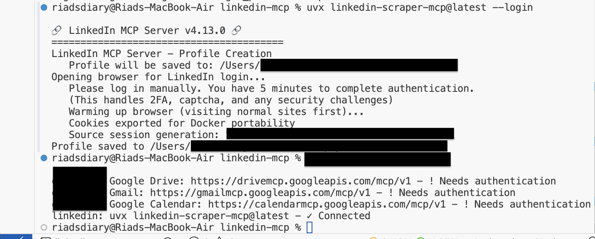
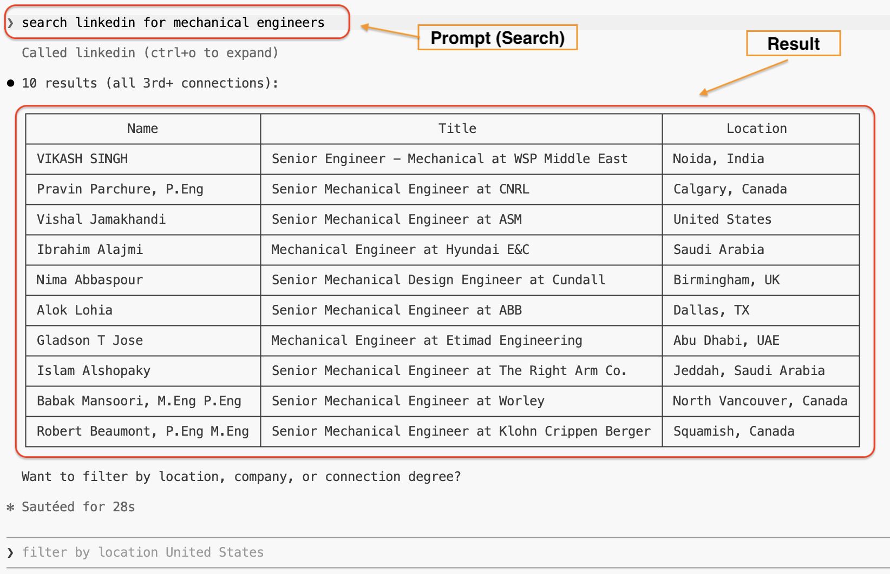
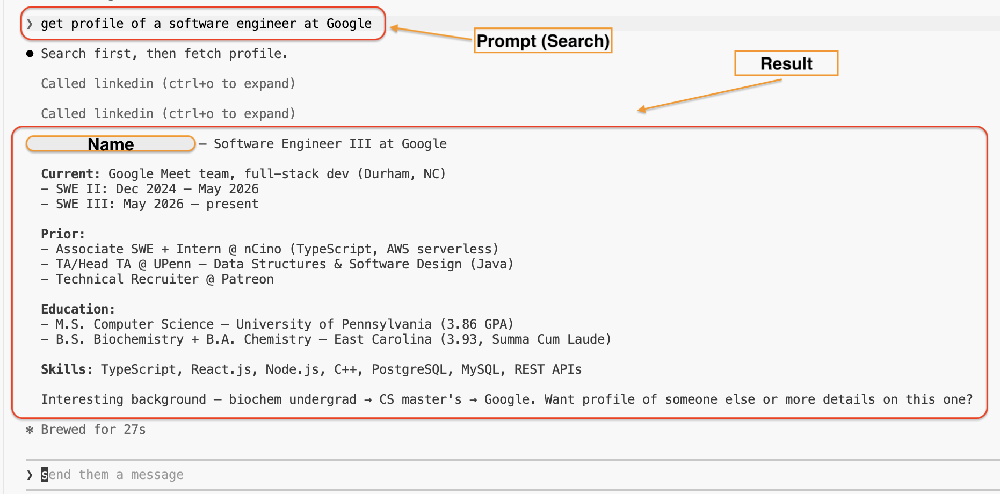

# linkedin-mcp

Connecting LinkedIn to a terminal through an MCP (Model Context Protocol) server. The goal was to search profiles, browse companies, and interact with LinkedIn without touching a browser — all from the command line.

It took three attempts to get working. Here's what happened and how to run it yourself.

<p align="center">

**Prompt:** `claude mcp list`<br>
**Result:** LinkedIn MCP server registered and connected — ready to use from terminal



<br>

**Prompt:** `search linkedin for mechanical engineers`<br>
**Result:** 10 real LinkedIn profiles returned — name, job title, company, and location pulled live



<br>

**Prompt:** `get the profile of a software engineer at Google`<br>
**Result:** Full LinkedIn profile data returned directly in the terminal — no browser opened



</p>

## What you need

- A LinkedIn account
- Python 3.11+ and `uv` (for the Python server)
- Node.js 18+ and `npm` (for the Puppeteer scripts)
- An MCP-compatible AI tool — pick one:
  - [Claude Code](https://claude.ai/code) (what this was built with)
  - [Cursor](https://cursor.sh) (supports MCP)
  - [Windsurf](https://codeium.com/windsurf) (supports MCP)
  - Or no AI at all — the Puppeteer scripts run standalone in any terminal

## Attempt 1 — Python library (`linkedin-api`)

Started with [`linkedin-api`](https://github.com/tomquirk/linkedin-api), a library that wraps LinkedIn's internal Voyager API. Built `server.py` on top of it using FastMCP and registered it with Claude Code as a tool server.

It worked briefly. The profile endpoint it relied on (`/identity/profiles/<urn>/profileView`) started returning `410 Gone`. The library crashed with a `KeyError` reading a field that no longer existed in the response. Profiles were broken and there was no fix on the library side.

`server.py` is still in the repo — the auth fallback and tool structure are reusable — but this approach alone doesn't hold up.

## Attempt 2 — Puppeteer + cookie extraction

Switched to browser automation. `login.js` opens a real Chrome window, logs in with credentials, and saves the session cookies to `linkedin_cookies.json`. `scrape_profiles.js` then loads those cookies into a headless browser and visits profiles directly.

Login was reliable. The problem was the second step — spinning up a headless Puppeteer instance with saved cookies triggered LinkedIn's bot detection. Sessions got flagged and profile pages returned redirect loops. Injecting the cookies back into the Python `linkedin-api` client (see `server.py`'s `get_client()`) worked slightly better but still hit 401s on consecutive calls.

`fetch_profiles.js` is a variant that logs in fresh every run rather than reusing cookies — more reliable but slow and not practical for repeated use.

## Attempt 3 — `linkedin-scraper-mcp` (working)

Found [`stickerdaniel/linkedin-mcp-server`](https://github.com/stickerdaniel/linkedin-mcp-server), an MCP server built specifically for this. It runs through `uvx`, uses Playwright with a persistent browser profile, and keeps the session alive across calls without re-authenticating.

This is the approach that works.

## Setup

### Option A — With an AI tool (Claude Code, Cursor, Windsurf)

This registers LinkedIn as a tool your AI can call directly from chat.

**Step 1 — Install uv**
```bash
pip install uv
```

**Step 2 — Log in once**
```bash
uvx linkedin-scraper-mcp@latest --login
```
A browser opens. Log into LinkedIn manually. Close it when done. Session is saved.

**Step 3 — Register with your AI tool**

Claude Code:
```bash
claude mcp add linkedin --scope user -- uvx linkedin-scraper-mcp@latest
```

Cursor — add this to your `~/.cursor/mcp.json`:
```json
{
  "mcpServers": {
    "linkedin": {
      "command": "uvx",
      "args": ["linkedin-scraper-mcp@latest"]
    }
  }
}
```

Windsurf — add this to your `~/.codeium/windsurf/mcp_config.json`:
```json
{
  "mcpServers": {
    "linkedin": {
      "command": "uvx",
      "args": ["linkedin-scraper-mcp@latest"]
    }
  }
}
```

**Step 4 — Use it**

Open your AI tool and ask anything:
- "search linkedin for mechanical engineers in New York"
- "get the profile for williamhgates on linkedin"
- "find software engineers at Google on linkedin"

The AI calls the LinkedIn tools and returns real results.

### Option B — No AI, just terminal (Puppeteer scripts)

Use these if you want to run searches directly without an AI tool.

**Step 1 — Install dependencies**
```bash
npm install
```

**Step 2 — Login and save cookies**
```bash
LINKEDIN_EMAIL="your@email.com" LINKEDIN_PASSWORD="yourpassword" node login.js
```
A real browser opens. Log in, solve any CAPTCHA. Cookies saved to `linkedin_cookies.json`.

**Step 3 — Scrape profiles**

Edit the `TARGETS` array in `scrape_profiles.js` with the LinkedIn slugs you want:
```javascript
const TARGETS = [
  { name: 'Person Name', slug: 'their-linkedin-slug' },
];
```
Then run:
```bash
node scrape_profiles.js
```

To visit profiles right after login (no separate scrape step):
```bash
LINKEDIN_EMAIL="your@email.com" LINKEDIN_PASSWORD="yourpassword" \
FETCH_PROFILES=williamhgates,satya-nadella node login.js
```

### Option C — Python server (standalone or with AI)

**Step 1 — Install dependencies**
```bash
pip install uv
uv sync
```

**Step 2 — Set credentials**

Create a `.env` file in the project folder:
```
LINKEDIN_EMAIL=your@email.com
LINKEDIN_PASSWORD=yourpassword
```

**Step 3 — Run**
```bash
uv run python server.py
```

Or register with an AI tool:
```bash
claude mcp add linkedin-py -- uv run python server.py
```

## Files

```
server.py           # Python MCP server — FastMCP + linkedin-api (Attempt 1 + cookie fallback)
login.js            # Puppeteer login — saves cookies, optional profile fetch
fetch_profiles.js   # Fresh login every run, visits target profiles
scrape_profiles.js  # Headless scraper using saved cookies from login.js
pyproject.toml      # Python dependencies
package.json        # Node dependencies
.gitignore          # Excludes linkedin_cookies.json, .env, node_modules
assets/             # Screenshots
```

## Security

Never commit credentials. Use env vars or `.env`. The `linkedin_cookies.json` file is gitignored — keep it that way. LinkedIn does not officially support third-party API access.

## Results

MCP server connected, LinkedIn search and profile lookup working directly from terminal. Screenshots above show the full flow end to end.
